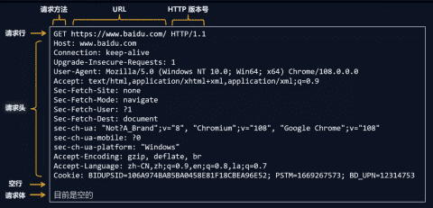
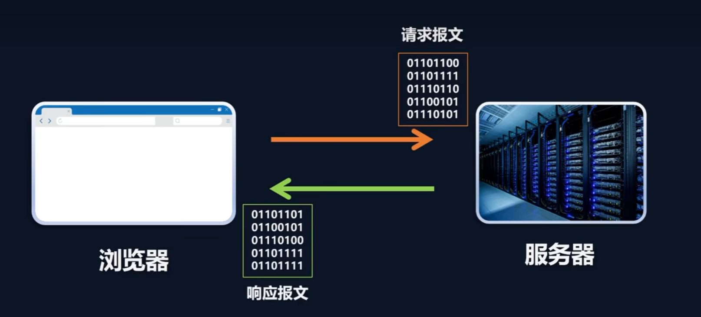
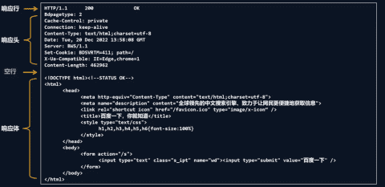
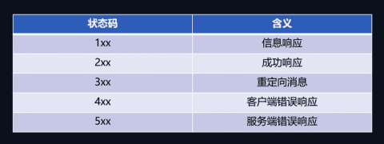
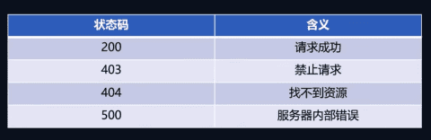
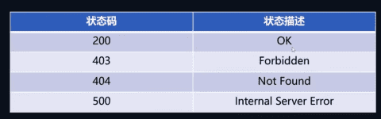
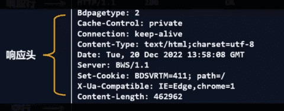
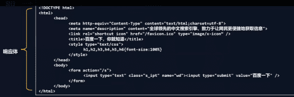
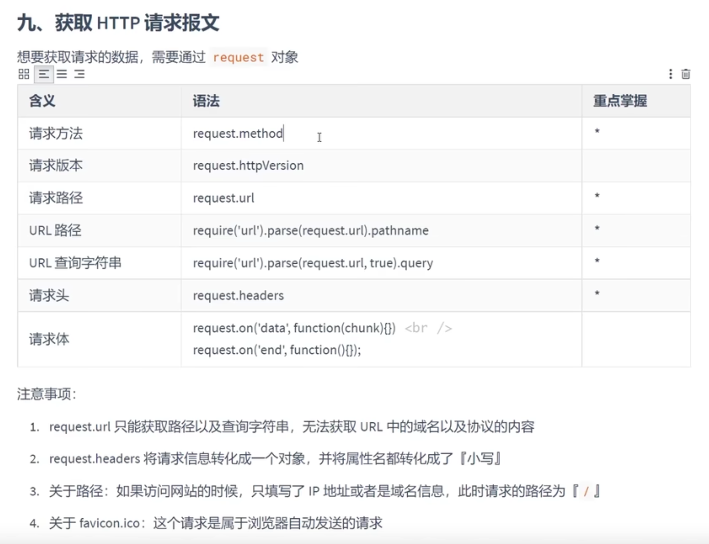

# http 协议

 

## 请求方法

| 请求方法                  | 说明                                                                                                                                     |
| ------------------------- | ---------------------------------------------------------------------------------------------------------------------------------------- |
| GET                       | 请求指定的页面信息，并返回实体主体。                                                                                                     |
| POST                      | 向指定资源提交数据进行处理请求（例如提交表单或者上传文件）。数据被包含在请求体中。POST 请求可能会导致新的资源的建立和/或已有资源的修改。 |
| PUT                       | 从客户端向服务器传送的数据取代指定的文档的内容。                                                                                         |
| PATCH                     | 是对 put 方法的补充，用来对已知资源进行局部更新。                                                                                        |
| DELETE                    | 请求服务器删除指定的页面。                                                                                                               |
|  | 以下是用的少的方法                                                                                                                       |
| HEAD                      | 类似于 get 请求，只不过返回的响应中没有具体的内容，用于获取报头                                                                          |
| CONNECT                   | HTTP/1.1 协议中预留给能够将连接改为管道方式的代理服务器。                                                                                |
| OPTIONS                   | 允许客户端查看服务器的性能。                                                                                                             |
| TRACE                     | 回显服务器收到的请求，主要用于测试或诊断。                                                                                               |

 

## 报文结构

### 请求行

| 请求方法 | URL                    | HTTP 版本号 |
| -------- | ---------------------- | ----------- |
| GET      | https://www.baidu.com/ | HTTP/1.1    |

 

> 例子 URL:
> | 协议名 | 主机名 | 端口号 | 路径 | 查询字符串 |
> | -------- | ------------- | ------ | ------- | ------------------------ |
> | https:// | search.jd.com | :443 | /search | ?keyword=oneplus&psort=3 |

 

### 请求头

键值对形式:

[🔍 请求头文档](https://developer.mozilla.org/zh-CN/docs/Web/HTTP/Headers)

 

### 请求体

字符串键值对形式:

%40 是 @, = 是 : , & 是 /

也可以是 json 格式

 

## HTTP 响应报文

### 响应头

状态码分类:

常用响应状态码:

[🔍 状态码文档](https://developer.mozilla.org/zh-CN/docs/Web/HTTP/Status)

 

### 响应头

content-type: 响应体的类型

content-length: 响应体的长度

[🔍 响应头文档](https://developer.mozilla.org/zh-CN/docs/Web/HTTP/Headers)

### 响应体

 

### 获取 HTTP 请求报文

